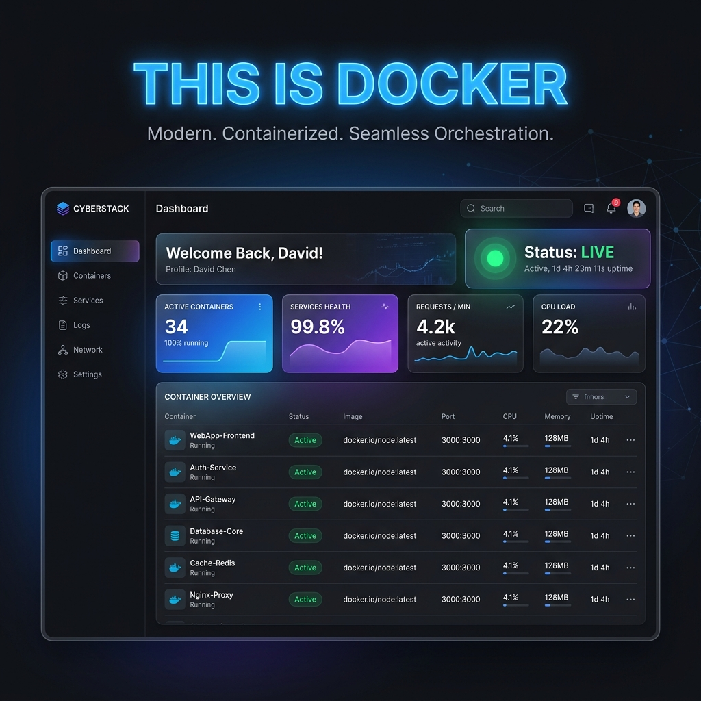

# 🐳 Lab: This is Docker.



 Today, we're not just writing code; we're **orchestrating environments**. We're taking a beautiful, modern web application and packaging it so perfectly that it can run anywhere in the world—from your laptop to the most massive data centers on the planet—with just a single command.


---

## 🏛️ The Philosophy

Imagine you've built a magnificent house. But you want to move it. In the traditional world, you'd have to take it apart, piece by piece, and hope you can put it back together in the new location. You might forget a nail, or the new soil might be different.

**Docker** is like shrinking that entire house, along with its foundation, its plumbing, and its electricity, into a single, indestructible shipping container. No matter where you ship that container, the house inside remains exactly the same.

---

## 🏁 Getting Started

We're going to dive right in. This lab assumes you have a **Docker-compatible runtime** on your machine. 

### 🍏 For the Mac M1/M2/M3 Users (Apple Silicon)

If you're using a modern Mac and prefer a lightweight, open-source alternative to Docker Desktop, we recommend **Colima**! It's a fantastic way to run containers directly on Apple Silicon.

To get set up with Colima, ensure you have [Homebrew](https://brew.sh/) installed, then run:

```bash
# 1. Install Colima and the Docker CLI
brew install colima docker

# 2. Start the Colima virtual machine
colima start
```

Once started, Colima "wires up" the Docker CLI so it works exactly like we expect!

### 🐳 The Standard Approach

Alternatively, if you're using **Docker Desktop** (available on Windows, Mac, and Linux), ensure the application is open and running.

To check if you're ready to go—regardless of whether you're using Colima or Docker Desktop—open your terminal and run:

```bash
docker --version
```

If you see a version number, you are ready to build!

### Step 1: Examine the Architecture

We've provided you with three essential files:

1.  `index.html`: Our structural blueprint.
2.  `style.css`: Our aesthetic layer (with some beautiful glassmorphism!).
3.  `Dockerfile`: The **recipe** for our container.

### 🔬 Deep Dive: The Dockerfile Anatomy

Before we build, let's look *inside* the recipe. Each line in a `Dockerfile` is a command to Docker, telling it how to construct our image, layer by layer.
```bash
# --- The Blueprint: Dockerfile ---
# We start with a base image. Nginx is a high-performance web server.
# Alpine is a super-small, lightweight Linux distribution.
FROM nginx:alpine

# Metadata: Let's tag this image so we know who built it!
LABEL maintainer=" Felex Rungu engineerfelex@gmail.com"

# --- The Assembly: Copying our Files ---
# We copy our local index.html and style.css into the container's 
# default directory for serving static content.
COPY index.html /usr/share/nginx/html/index.html
COPY style.css /usr/share/nginx/html/style.css

# --- The Logistics: Opening Ports ---
# Nginx traditionally runs on port 80. We tell Docker that our
# container intends to listen on this port.
EXPOSE 80

# --- The Startup: Launching the Server ---
# This command tells Docker exactly what to execute when the container starts.
# Nginx will run in the foreground so the container stays alive.
CMD ["nginx", "-g", "daemon off;"]


```

- **`FROM nginx:alpine`**: We aren't building a web server from scratch! We're starting with `nginx` (a high-performance industry standard) running on `alpine` (an incredibly small, efficient Linux distribution). Standing on the shoulders of giants!
  
- **`LABEL maintainer="..."`**: Good code is well-documented. This metadata identifies you as the architect of this specific image.

- **`COPY index.html /usr/share/nginx/html/index.html`**: This is the transition from *your* computer to the *container's* world. We are taking the structure of our site and placing it exactly where the web server expects it.

- **`COPY style.css /usr/share/nginx/html/style.css`**: Just like we copied the structure, we now copy the aesthetics. Our container now has everything it needs to look stunning.

- **`EXPOSE 80`**: Containers are isolated by default. This is like telling the container, "You're allowed to have a window on port 80 so the world can see your website!"

- **`CMD ["nginx", "-g", "daemon off;"]`**: This is the heart of the container. It's the command that runs when the container starts. We're telling Nginx to stay in the "foreground" so the container keeps running as long as the web server is alive.

---

## 🛠️ Step 2: Building the Image

Now, we need to take our "recipe" (the Dockerfile) and turn it into a "cake" (the Image). In your terminal, navigate to this directory and run:

```bash
docker build -t my-beautiful-site .
```

Let's break this down:
- `docker build`: "Hey Docker, build something!"
- `-t my-beautiful-site`: "Tag this image with a friendly name: `my-beautiful-site`."
- `.`: "Look for the `Dockerfile` right here in this current directory."

**Watch the terminal!** You'll see Docker pulling the base image, copying your files, and finalizing the build. This is the assembly line in action!

---

## 🚀 Step 3: Launching the Container

We have the image. Now, let's bring it to life! Run:

```bash
docker run -d -p 8080:80 --name cs50-container my-beautiful-site
```

The flags are crucial:
- `-d`: **Detached mode**. Run this in the background so we can keep using our terminal.
- `-p 8080:80`: **Port Mapping**. Map port `8080` on *your machine* to port `80` *inside the container*. 
- `--name cs50-container`: Give our running instance a professional name.
- `my-beautiful-site`: Use the image we just built!

---

## 🌐 Step 4: The Moment of Truth

Open your favorite web browser and navigate to:

[http://localhost:8080](http://localhost:8080)

**BOOM!** If you see a vibrant, pulsing, glassmorphic landing page, you have officially containerized your first application. This isn't just a website; it's a **portable piece of infrastructure**.

---

## 🧹 Step 5: Clean Up

In the world of infrastructure, we don't leave things running forever if we don't need them. To stop and remove your container:

```bash
docker stop cs50-container
docker rm cs50-container
```

---

## 💪 Challenges & Teachable Moments

In the world of computer science, we often learn more from our **errors** than from our successes. Here are the hurdles we cleared during this lab:

### 1. The Spelling Symphony
- **Challenge**: We ran into an error trying to `docker buid`. 
- **The Lesson**: Compilers and CLIs are incredibly precise. A single missing character (**build** vs **buid**) can stop a multi-gigabyte orchestration in its tracks!
- **Solution**: Careful proofreading and understanding that `-t` is a flag specifically for the `build` command.

### 2. Nouns vs. Verbs (Images vs. Processes)
- **Challenge**: We tried running `docker images ps`. 
- **The Lesson**: Docker distinguishes between our "Static Recipes" (**Images**) and our "Running Instances" (**Processes/Containers/PS**). Running them together confused the CLI!
- **Solution**: Use `docker images` to see your library and `docker ps` to see what is currently alive and breathing.

### 3. Architecture & The M1 Leap
- **Challenge**: Standard Docker tools can sometimes be heavy or complex on modern Apple Silicon (M1/M2/M3) Macs.
- **The Lesson**: Modern hardware sometimes requires modern, lightweight alternatives.
- **Solution**: We integrated **Colima**! A lightweight way to bridge the gap and run our Docker commands seamlessly on Mac Silicon.
