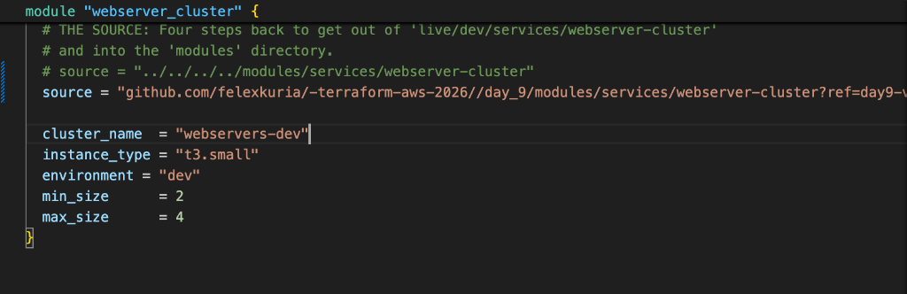
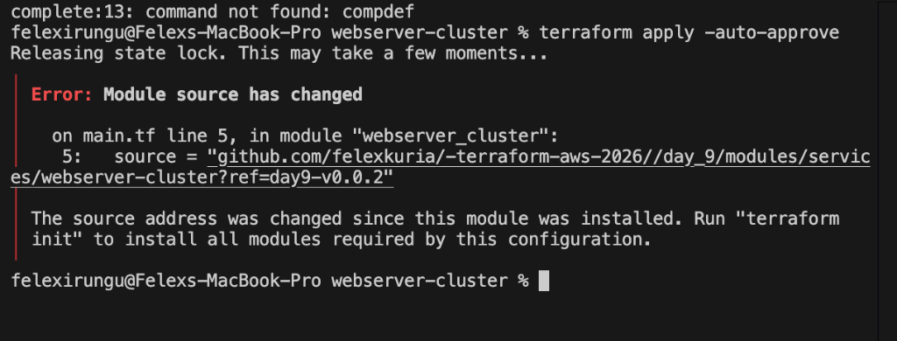
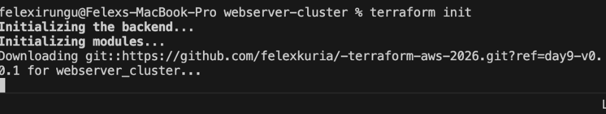
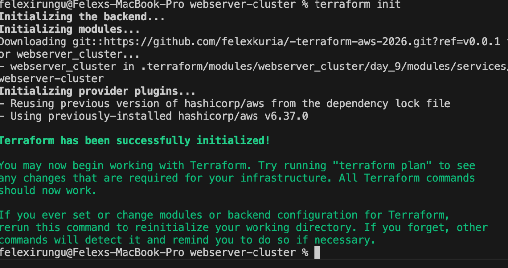

# Day 9 — Advanced Terraform Modules: Versioning & Gotchas

## ⏪ Recap of Day 8: Reusable Infrastructure
Yesterday, we achieved **Abstraction**. We wrote our infrastructure code once inside a **Module** and then deployed it across `dev` and `production` environments with just 10 lines of code.

**Key Achievements from Day 8:**
- **Blueprint vs. Construction Site**: We separated modular logic (`modules/`) from deployment configurations (`live/`).
- **Input Variables**: We used variables like `cluster_name` and `instance_type` to make our code environment-agnostic.
- **Output Wiring**: We learned that module outputs must be explicitly re-declared in the `live/` config to surface in the terminal.

---

Building on yesterday’s achievement of **Abstraction**—where we separated our Blueprint from the Construction Site—we now enter the most critical phase: **Lifecycle Management**. 

In professional infrastructure, we don't just "write code"—we manage a **lifecycle**. While Day 8 taught us how to reuse code, Day 9 is about **Safety**. Versioning is the bridge that allows us to experiment in Dev with a new blueprint version (`v0.0.2`) while keeping Production safely locked to a proven, stable one (`v0.0.1`). This ensures that a change in one environment never accidentally breaks another.

---

## 🎯 The Versioning Mindset
Yesterday, we separated the **blueprint** from the **build site**. Today, we lock that blueprint in a **Vault (Git)**. By using versioning, you treat your infrastructure exactly like software: you release updates, test them in Dev, and only promote them to Production when they are proven stable.
```
day_9/
├── modules/ (The Blueprint)           ──> Push to GitHub (v0.0.1, v0.0.2)
└── live/ (The Build Site)
    ├── dev/                           ──> Uses v0.0.2 (Testing new features)
    └── production/                    ──> Uses v0.0.1 (Stay on Stable)
```

---

## 🛑 Step 1: Master the Module Gotchas

Before versioning, you must avoid these three common mistakes that catch engineers off guard:

- **Gotcha 1: The File Path Trap**: Relative paths like `./script.sh` resolve to the terminal's location, not the module's.
  - **The Fix**: Use `path.module` (e.g., `"${path.module}/user-data.sh"`).
- **Gotcha 2: Inline Blocks vs Separate Resources**: Mixing `ingress` blocks and standalone `aws_security_group_rule` resources causes conflicts.
  - **The Rule**: Use separate resources in modules to allow callers to add their own custom rules.
- **Gotcha 3: Output Dependencies**: Depending on a module output makes Terraform wait for the *entire* module.
  - **The Fix**: Expose specific, granular outputs to keep your dependency tree fast.

---

## 📦 Step 2: Put Your Module in the "Vault" (Versioning)
Professional teams use Git tags to snapshot their modules. First, ensure you have your repository's HTTPS URL:



### 2a. Versioning with an EXISTING Repository
We are **reusing the modular architecture** from Day 8 (the `modules/` and `live/` folders). If you are already tracking your project from the root (as we are), Git tags the **entire repository** at once. You don't need to "navigate" inside the module folder for Git; you just need to ensure your code is committed.

#### 📂 How to handle many folders (The Monorepo Approach)
If your repository has folders for `day_6`, `day_7`, `day_8`, and `day_9`, you might wonder: *"How does Terraform know I only want Day 9?"*

1. **The Git Tag captures everything**: When you run `git tag`, you are taking a snapshot of the **whole project** (all days).
2. **The Source Path "Zooms In"**: Terraform uses the **Double Slash (`//`)** syntax (see Step 3) to navigate inside that snapshot. Everything **before** the `//` is for downloading the repo; everything **after** it is for navigating to the specific folder.

**The CLI Workflow for Stable & Dev Tags:**
```bash
# 1. Stay in the root of your project
# 2. Add and commit all Day 9 modular changes
git add .
git commit -m "Day 9: Verifying versioned modules"

# 3. Create a STABLE tag for Production
# (You can prefix it with 'day9-' to be extra clear)
git tag -a "day9-v0.0.1" -m "Stable Version for Day 9"
git push origin day9-v0.0.1

# 4. Create a DEV tag for experimentation
git tag -a "day9-v0.0.1-dev" -m "Dev version for Day 9"
git push origin day9-v0.0.1-dev
```
*Note: Although Git tags the whole repo, Terraform "navigates" to the specific module folder using the `//` syntax in the source URL (see Step 3).*

### 2b. Versioning with a NEW Repository
Use this if you are creating a dedicated repository for this module from scratch:

```bash
# 1. Start fresh in the module folder
cd modules/services/webserver-cluster/
git init

# 2. Add and commit your code
git add .
git commit -m "Initial commit of webserver-cluster module"

# 3. Link to a NEW GitHub repo and push
git remote add origin https://github.com/your-username/terraform-aws-webserver-cluster
git push origin main

# 4. Tag and push the tag
git tag -a "v0.0.1" -m "First stable release"
git push origin --tags
```

### B. Creating a GitHub Release (The Pro Look)
To make your module look professional for your team:
1. Go to your repository on **GitHub**.
2. Click on **Releases** (on the right sidebar).
3. Click **Draft a new release**.
4. Click **Choose a tag** and select `v0.0.1`.
5. Enter a title (e.g., "First Stable Release") and describe the changes.
6. Click **Publish release**.

---

## 🏗️ Step 3: Deployment & The Private Repo Problem

### The Sub-Folder "Gotcha" (Double Slash)
Since your module is inside `day_9/modules/...`, you MUST tell Terraform exactly where to look inside the repo using the **Double Slash (`//`)**:
Configure your `main.tf` to point to the remote GitHub source using the `?ref=` syntax:



```hcl
module "webserver_cluster" {
  # Format: github.com/<user>/<repo>//<folder_path>?ref=<tag>
  source = "github.com/felexkuria/-terraform-aws-2026//day_9/modules/services/webserver-cluster?ref=day9-v0.0.1"
  
  # ... inputs
}
```

### ✅ Verification: Successful Initialization
When you run `terraform init`, Terraform will download the module for the first time:


### ⚠️ Troubleshooting: "Module source has changed"
If you update the `ref` tag in your code but don't re-run `init`, you will see this error:



**The Fix**: Simply run `terraform init` again to download the new version.

---

---

## 🚀 Test Flight: How to Test Your Tags
Follow this step-by-step guide to verify that your versioning is working correctly.

### 1. Make a minor change in the Module
Open `day_9/modules/services/webserver-cluster/main.tf` and add a small, visible change (e.g., update the `user_data` text to say "Hello Version 2").

### 2. Push the Change & Tag it as `v0.0.2`
From your project root, snapshot this new version:
```bash
git add .
git commit -m "Day 9: Testing versioning with a new release"
git tag -a "day9-v0.0.2" -m "Experimental release v2"
git push origin day9-v0.0.2
```

### 3. Update ONLY the DEV environment
Navigate to `day_9/live/dev/services/webserver-cluster/main.tf` and update the `ref` to target your new tag:
```hcl
module "webserver_cluster" {
  source = "github.com/felexkuria/-terraform-aws-2026//day_9/modules/services/webserver-cluster?ref=day9-v0.0.2"
  # ... rest of config
}
```

### 4. Re-initialize and Apply in DEV
```bash
cd day_9/live/dev/services/webserver-cluster/
terraform init -upgrade   # CRITICAL: The -upgrade flag forces Terraform to pull the new tag
terraform apply
```

### 5. Verify Production is Safe
Go to `day_9/live/production/services/webserver-cluster/` and run `terraform plan`. You will see **0 changes**. Production is still pinned to `v0.0.1` and is completely protected from your experimental changes in Dev.

---

## 👨‍🏫 Why Versioning Matters

Without versioning, if you change `modules/main.tf` to test something in **Dev**, you accidentally change **Production** at the same time.

**With Versioning:**
1. You push changes and tag them as `v0.0.2`.
2. You update **Dev** to `v0.0.2` and verify it works.
3. **Production** remains untouched on `v0.0.1` until you are 100% ready to switch.

---

## ⚠️ Challenges & Fixes

### 🛑 `terraform init` Caching
If you update a tag in Git, Terraform might still use the old version cached in `.terraform/modules`.
- **Fix:** Run `terraform init -upgrade` to force a fresh download of the module.

### 🛑 Git Source URL Format
The URL must be precise. For GitHub, it usually looks like:
`github.com/<user>/<repo>?ref=<tag>`

### 🛑 The "Side Effect" Module
Avoid modules that create "global" resources (like an IAM Role with a hardcoded name). If you call that module twice, the names will collide. Always make global resource names dynamic using `var.cluster_name`.

---

## 🔄 Summary
You have now transitioned from "Terraform Beginner" to "Infrastructure Architect." You are no longer just writing code; you are managing a **lifecycle**.

#30DayTerraformChallenge #IaC #DevOps #Versioning #Aesthetics

---

## 🏆 Proof of Work (POW)

### Successful GitHub Versioning


---

## 📊 Semantic Versioning (SemVer) 101

Is your tag `day9-v0.0.1` a "Semantic Version"? **Almost!**

SemVer (Semantic Versioning 2.0.0) follows the `MAJOR.MINOR.PATCH` format:
- **Major (X.0.0)**: Breaking changes (e.g., removing a required variable).
- **Minor (0.X.0)**: Adding new features (e.g., adding an optional `instance_type` toggle).
- **Patch (0.0.X)**: Bug fixes (e.g., fixing a typo in your `user_data` script).

### Analysis of your tag: `day9-v0.0.1`
- **The Prefix (`day9-`)**: Strictly speaking, SemVer doesn't include prefixes. However, in **Monorepos** (like yours), using a prefix is a **Best Practice**. It tells your team *which* module is being versioned.
- **The Version (`0.0.1`)**: This part is perfectly SemVer-compliant.
- **The Extension (`-dev`)**: In `v0.0.1-dev`, the `-dev` is what SemVer calls a **Pre-release Identifier**. This is also perfectly compliant and tells the world this isn't the final stable version.

**The Pro Verdict:** Your tagging strategy is excellent for a multi-day learning repo. It keeps your code organized and follows the spirit of industry standards.
